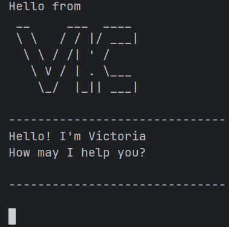

# Victoria User Guide





**Victoria** is a lightweight, offline task-tracking CLI chatbot you can run from the terminal or inside IntelliJ.
It lets you add tasks with sub categories of deadlines, events, mark and unmark.
There is also a search, list, delete and save with commands. 
Your tasks autosave to a file so they’re there the next time you launch.

## Quick start 
Run the program using
`java Victoria`

## Exiting the program 
Exit the program by using
`bye`

## Adding to-dos
Adds a task into the task list.

Format:`todo [task description]`

Example:`todo sleep`

Output will give:
1. Confirmation message that task was added 
2. Example of what will appear on the list
3. Number of tasks currently in the list

```
ok added the following task bro:
[ ] sleep
now you got 1 tasks in your list.
```


## Adding deadlines

Adds a task with a deadline into the task list with a `[D]` to indicate
that it is a deadline task.

Format: `deadline [description of task] /by [deadline]`

Example: `deadline sleep /by sunday`

Output will give:
1. Confirmation message that task with deadline added
2. Example of what will appear on the list
3. Number of tasks currently in the list 

```
okies brother. I added this deadline!
[D][ ] sleep (by: sunday)
now you got: 2 tasks
```
## Adding events 
Adds a task with the category of an event to the tasks list with a `[E]` 
to indicate that it is an event.

Format: `event [event description] /from [time] to [time]`

Example `event sleep /from Monday 2pm to 4pm `

Output will give:
1. Confirmation message that event has been added 
2. Example of what will appear on the list
3. Number of tasks currently in the list

```
okies brother. I added this event!
[E][ ] sleep (from: Monday 2pm to: 4pm)
now you got: 3 tasks

```

## Mark task as done
Indicates that tasks are done by marking the with a `[X]`.

Format: `mark [index of the task in the list]`

Example: `mark 2`

Output will give:
1. Confirmation message of successfully marking the task
2. Example of what will appear on the list (addition of `[X]`)

```
Nice la , I have marked it as done!
 [D][X] sleep (by: sunday)
 
```


## Unmark a marked task 
Unmarks a task that was previously marked as done.

Prerequisite: The task must have already been marked done to be unmarked

Format: `unmark [index of the marked task in list`

Example: `unmark 2`

Output will give: 
1. Confirmation message that the marked task has been unmarked
2. Example of what it will look like in the task list


```
Shag , I have marked it as undone!
 [D][ ] sleep (by: sunday)
```


## Listing out tasks 
Lists out all the tasks currently in the task lists with their categories and status.

Format: `list`

Output will give the lists of tasks currently in the task list 

```
Here are your tasks bro:
1. [ ] sleep
2. [D][ ] sleep (by: sunday)
3. [E][ ] sleep (from: Monday 2pm to: 4pm)
```

## Search for tasks with keywords
Filter out the tasks with the keyword provided and display the filtered tasks in a list

Format: `find [keyword]`

Example list 
```
Here are your tasks bro:
1. [ ] sleep
2. [D][ ] sleep (by: sunday)
3. [E][ ] sleep (from: Monday 2pm to: 4pm)
4. [ ] eat
5. [D][ ] eat (by: tuesday)
```
Wanting to filter sleep tasks:

`find sleep`

will output the tasks with the keyword sleep

```
Here are your tasks bro:
1. [ ] sleep
2. [D][ ] sleep (by: sunday)
3. [E][ ] sleep (from: Monday 2pm to: 4pm)
```

## Delete task
Deletes a specific task from the list.

Format: `delete [index of the task in the list]`

Example list:
```
Here are your tasks bro:
1. [ ] sleep
2. [D][ ] sleep (by: sunday)
3. [E][ ] sleep (from: sunday 2pm to: 4pm)
```

Wanting to delete the second task

`delete 2`

will output:
1. Confirmation message that the task has been deleted 
2. Show the task that was deleted 
3. Number of tasks left 
```
thy task have been vanquished!
[D][ ] sleep (by: sunday)
now you only left with 2 tasks!
```